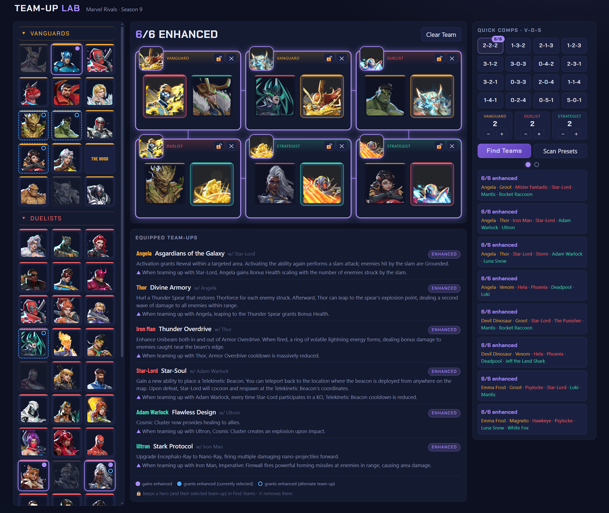
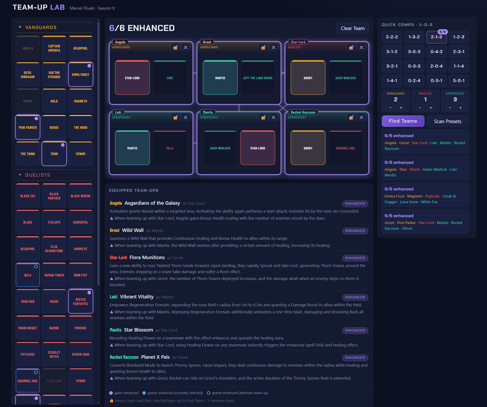
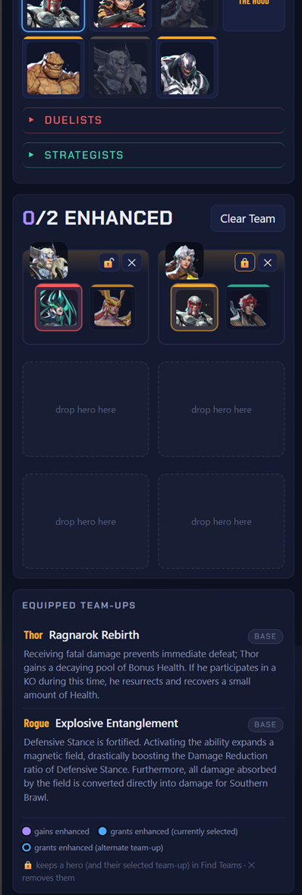

# Rivals S9 Team-Up Lab

An unofficial, single-file team-composition sandbox for **Marvel Rivals Season 9**.
Slot six heroes, see exactly which team-up loadouts go **Enhanced**, and brute-force
the best comps — all in one HTML file with zero dependencies.

**▶ Try it live: [randolin.github.io/rivals-teamup-lab](https://randolin.github.io/rivals-teamup-lab/)**

**The full board** — six slots, live team-up readout, roster intel, and the optimizer, with the avatar pack installed:

**No avatars? No problem** — without the optional icon pack, heroes render as text tiles and every feature still works:

**Mobile layout** — collapses to a single-column scroll with touch-sized controls:

## What it does

Season 9 reworked team-ups: every hero has **two team-up loadouts**, each with a
base effect (always on) and an enhanced effect (active when the named partner is
on your team) — but only **one** loadout equipped per match. Keeping track of 104
team-ups across 50+ heroes in your head is miserable. This tool doesn't make you.

- **Build board** — six slots, click or drag heroes in. Each card shows the hero's
  two partners as buttons; click one to pin that loadout, or let the auto-equip
  pick whichever loadout's partner is already on the team.
- **Live readout** — every slotted hero's equipped team-up with its official base
  and enhanced descriptions, plus synergy lines drawn between enhanced pairs.
- **Roster intel** — dots on every unslotted hero show how they'd connect to your
  current team: *gains enhanced* (violet), *grants enhanced to a selected loadout*
  (blue), or *grants via a loadout swap* (blue ring).
- **Optimizer** — pick a role comp (2-2-2, 1-3-2, …) and **Find Teams** enumerates
  every legal roster for it, ranked by enhanced count. **Lock** heroes to force
  them (and their selected team-up) into every result. **Scan Presets** badges all
  16 comps with their best possible score under your current locks.
- **Shareable links** — the full board state (heroes, locks, loadout picks, comp)
  lives in the URL hash. Copy the address bar, paste it in Discord, argument settled:
  `…#t=thor.vL0,hela.d,deadpool.s1&c=1-3-2`
- **Mobile friendly** — collapses to a single-column layout with touch-sized controls.

## Using it

No build, no install, no network requirement beyond Google Fonts (which degrades
gracefully offline). Either use it at
**[randolin.github.io/rivals-teamup-lab](https://randolin.github.io/rivals-teamup-lab/)**
or download `index.html` and open it in any modern browser (2023+).

## Avatars (optional)

The tool works fully without images — heroes render as text tiles. With an
`avatars/` folder beside the HTML, tiles and cards use icons in three tiers:

| Tier | Filename | Shown when |
|---|---|---|
| Normal | `Hero_Icon_<Name>.webp` | No enhanced team-up available |
| Lord | `Lord_Icon_<Name>.webp` | Enhanced available, but not the active pick |
| Champion | `Champion_Icon_<Name>_Animated.webp` | Enhanced **and** activated (animated) |

`<Name>` is the in-game name with spaces/ampersands as underscores, capitalization
preserved: `The_Punisher`, `Jeff_the_Land_Shark`, `Cloak_Dagger`, `Star-Lord`.
Missing tiers fall back downward (Champion → Lord → Normal → text), so a partial
set is fine. A fully-firing team literally animates.

Icons in this repo were sourced from the community-maintained
[Marvel Rivals Wiki](https://marvelrivals.fandom.com/wiki/Avatars).

## Data

Team-up names and base/enhanced descriptions are synced to the official Marvel
Rivals site's Season 9 team-up pages, **as of July 10, 2026**. Balance patches
will drift numbers over time, and The Hood's team-up loadouts arrive mid-season —
the data is one plainly-formatted `RAW` array at the top of the file's script if
you spot something stale. Corrections welcome via Issues or PRs.

## How the optimizer works (for the curious)

Hero partnerships are packed into bitmasks, so scoring a candidate team is a few
AND operations. Find Teams enumerates every combination for the selected comp
(tens to hundreds of thousands of teams, under half a second), buckets results by
enhanced count and lock satisfaction, and applies a diversity filter so the top
list isn't ten near-identical rosters. Locked heroes are pinned to whichever
loadout is displayed at search time — what you see is what gets enforced.

## Feedback & contributing

Bug reports, stale-data corrections, and feature ideas → GitHub Issues. The whole
app is one commented HTML file; PRs are easy to review.

## Built with AI

In the spirit of transparency: this tool was "vibe-coded" — designed, iterated,
debugged, and reviewed in collaboration with AI tools, with a human directing,
testing, and shipping it. Judge the result on its merits: the entire app is one
readable, commented HTML file with no build step, no trackers, no accounts, and
no network calls beyond Google Fonts — auditable in a single sitting if you'd
like to see for yourself.

## License & disclaimers

Code is released under the [MIT License](LICENSE). **The license covers the code
only.** Files in `avatars/` are the property of NetEase Games and Marvel, included
non-commercially for identification purposes, and will be removed immediately upon
request by the rights holders — the tool is fully functional without them.

This is a free fan-made tool. It is not affiliated with, endorsed by, or connected
to NetEase Games or Marvel in any way. Marvel Rivals and all associated characters
and materials are trademarks and copyrights of their respective owners.
